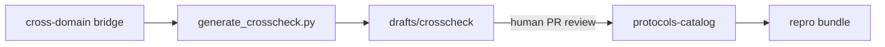

# Crosscheck — Prove the Bridge

**USDR maps what connects. Crosscheck proves it.**

Crosscheck turns USDR cross-domain bridges into **schema-validated, reproducible experiment protocols**. Every protocol links back to a source bridge, optional hypothesis and unknown, and includes a falsifiable prediction you can test on a laptop, in the field, or in the lab.

---

## The gap Crosscheck fills

USDR bridges already contain:

- `translation_table` — term-by-term mappings between fields
- `cross_pollination_opportunities` — concrete experiments that become possible when both fields share knowledge

Until Crosscheck, those opportunities lived only as prose in YAML. **Nobody indexed them as runnable protocols.**

Crosscheck closes the last mile: *crosscheck the bridge* — verify the mathematical connection with a real experiment.

---

## How it works



1. **Generate** — `generate_crosscheck.py` reads a bridge and drafts one protocol per `cross_pollination_opportunity`.
2. **Review** — drafts stay in `drafts/crosscheck/` until a human promotes them to `protocols-catalog/` via PR.
3. **Run** — each promoted protocol has a `repro_bundle` with a self-contained script.
4. **Report** — update protocol `status` to `executed`, `confirmed`, or `falsified` based on results.

Same governance as Wave Factory: automation proposes, humans merge.

---

## Quick start

```bash
# Preview protocols from a bridge
python scripts/generate_crosscheck.py --bridge b-habitat-percolation-ecology --dry-run

# Write drafts for review
python scripts/generate_crosscheck.py --bridge b-habitat-percolation-ecology --write

# Run a seed protocol
pip install -r repro/p-b-habitat-percolation-ecology-fss/requirements.txt
python repro/p-b-habitat-percolation-ecology-fss/simulate_percolation_fss.py

# Validate all protocols
python scripts/validate_schemas.py
```

---

## Protocol catalog

Canonical protocols live in [`protocols-catalog/`](../protocols-catalog/). Seed examples:

| Protocol | Bridge | Tier |
|----------|--------|------|
| `p-b-habitat-percolation-ecology-fss` | Habitat fragmentation ↔ percolation | desktop |
| `p-b-habitat-percolation-ecology-cluster-exponent` | Same bridge, cluster size distribution | desktop |
| `p-b-percolation-epidemiology-fss` | Epidemic threshold ↔ bond percolation | desktop |

---

## Contributing a protocol

**Without code** — promote a draft from `drafts/crosscheck/` after filling in `experimental_design` and `falsifiable_prediction`.

**With code** — add a `repro/{protocol-id}/` bundle:

```
repro/p-b-your-protocol-id/
├── README.md
├── requirements.txt
└── your_script.py
```

Set `repro_bundle` in the protocol YAML to `repro/p-b-your-protocol-id/`.

See [`schemas/protocol.yaml`](../schemas/protocol.yaml) for the full schema.

---

## Relationship to USDR

| USDR artifact | Crosscheck artifact |
|---------------|---------------------|
| `cross-domain/b-*.yaml` | `source_bridge` |
| `hypotheses/h-*.yaml` | `source_hypothesis` |
| `unknowns-catalog/u-*.yaml` | `source_unknown` |
| `cross_pollination_opportunities[n]` | `falsifiable_prediction` + `pollination_index` |

Crosscheck does not replace bridges or hypotheses — it **operationalizes** them.

---

## Roadmap

| Phase | Goal |
|-------|------|
| **MVP** (now) | Schema, generator CLI, 3 seed protocols + repro bundles |
| **Phase 2** | Protocol links on bridge explainer pages in the dashboard |
| **Phase 3** | Execution results YAML fed back to hypothesis validation |
| **Phase 4** | Unified percolation toolkit across ecology, epidemiology, oncology bridges |

---

## Citation

If you use Crosscheck protocols in research, cite USDR and note the protocol ID:

> Shoemaker, B. and Contributors. *Universal Science Discovery Repository — Crosscheck protocol `p-b-habitat-percolation-ecology-fss`.* 2026. [https://github.com/KR8ZYSHO3/Universal-Science-Discovery](https://github.com/KR8ZYSHO3/Universal-Science-Discovery)