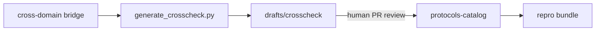

# Crosscheck — Prove the Bridge

**USDR maps what connects. Crosscheck proves it.**

Crosscheck turns USDR cross-domain bridges into **schema-validated, reproducible experiment protocols**. Every protocol links back to a source bridge, optional hypothesis and unknown, and includes a falsifiable prediction you can test on a laptop, in the field, or in the lab.

---

## The gap Crosscheck fills

USDR bridges already contain:

- `translation_table` — term-by-term mappings between fields
- `cross_pollination_opportunities` — concrete experiments that become possible when both fields share knowledge

Until Crosscheck, those opportunities lived only as prose in YAML. **Nobody indexed them as runnable protocols.**

Crosscheck closes the last mile: *crosscheck the bridge* — verify the mathematical connection with a real experiment.

---

## How it works


```mermaid
flowchart LR
    Bridge[cross-domain bridge] --> Gen[generate_crosscheck.py]
    Gen --> Draft[drafts/crosscheck]
    Draft -->|human PR review| Catalog[protocols-catalog]
    Catalog --> Repro[repro bundle]
```

1. **Generate** — `generate_crosscheck.py` reads a bridge and drafts one protocol per `cross_pollination_opportunity`.
2. **Review** — drafts stay in `drafts/crosscheck/` until a human promotes them to `protocols-catalog/` via PR.
3. **Run** — each promoted protocol has a `repro_bundle` with a self-contained script.
4. **Report** — update protocol `status` to `executed`, `confirmed`, or `falsified` based on results.

Same governance as Wave Factory: automation proposes, humans merge.

---

## Quick start

```bash
# Preview protocols from a single bridge (dry-run; any one bridge is fine)
python scripts/generate_crosscheck.py --bridge b-habitat-percolation-ecology --dry-run

# Happy-path write (do not use --all — too noisy)
python scripts/generate_crosscheck.py --bridge b-percolation-oncology --write

# Run a seed protocol (browser demo — no install)
# https://kr8zysho3.github.io/Universal-Science-Discovery/repro/p-b-habitat-percolation-ecology-fss/index.html

# Or local Python (verification)
pip install -r repro/p-b-habitat-percolation-ecology-fss/requirements.txt
python repro/p-b-habitat-percolation-ecology-fss/simulate_percolation_fss.py

# Validate all protocols
python scripts/validate_schemas.py
```

Drafts land at `drafts/crosscheck/<parent of the bridge YAML relative to cross-domain/>/<protocol_id>.yaml`. For the command above that is `drafts/crosscheck/physics-oncology/p-b-percolation-oncology-*.yaml` (opportunity 1 raw id `p-b-percolation-oncology-percolation-derived-metrics-giant-compon`). Do not use `--all` as the documented happy path.

---

## Protocol catalog

Canonical protocols live in [`protocols-catalog/`](../protocols-catalog/). Seed examples:

| Protocol | Bridge | Tier |
|----------|--------|------|
| `p-b-habitat-percolation-ecology-fss` | Habitat fragmentation ↔ percolation | desktop (browser demo) |
| `p-b-habitat-percolation-ecology-cluster-exponent` | Same bridge, cluster size distribution | desktop (browser demo) |
| `p-b-ising-social-dynamics-ewi` | Ising ↔ social dynamics EWI | desktop (browser demo) |
| `p-b-percolation-epidemiology-fss` | Epidemic threshold ↔ bond percolation | desktop (Colab demo) |
| `p-b-percolation-oncology-gcc` | Tumor vasculature ↔ percolation GCC | desktop (local Python; INCONCLUSIVE) |

## Run-mode parity

Python is canonical; browser and Colab are demo tier.

| protocol id | Python canonical | browser JS | Colab | CI grep CONFIRMED | RESULT contract |
|-------------|--------------|------------|-------|-------------------|-----------------|
| `p-b-habitat-percolation-ecology-fss` | `simulate_percolation_fss.py` (L∈{16,32,64,128}, `TRIALS_PER_P=350`) | yes, `simulate_percolation_fss.js` (same L, `TRIALS_PER_P=120`) | no | yes | stdout `RESULT:` token; Python `return 0` always |
| `p-b-habitat-percolation-ecology-cluster-exponent` | `cluster_size_exponent.py` (`P=0.59`, `L=256`, `SEEDS=20`) | yes, `cluster_size_exponent.js` (`P=0.592`, `L=128`) | no | yes | stdout `RESULT:` on success; can `return 1` if too few clusters / NaN fit |
| `p-b-ising-social-dynamics-ewi` | `ising_critical_slowing.py` (`LATTICE_SIZE=48`) | yes, `ising_critical_slowing.js` (`L=32`, lighter sweeps) | no | yes | stdout `RESULT:` token; Python `return 0` always |
| `p-b-percolation-epidemiology-fss` | `epidemic_percolation_fss.py` (networkx; freeze `NU_THEORY=3.0`) | **no** (not in `BROWSER_RUNNERS`; D-09) | yes, `run_crosscheck.ipynb` | yes | stdout `RESULT:` token; Python `return 0` always |
| `p-b-percolation-oncology-gcc` | `giant_component_fraction.py` (`L=32`, `TRIALS=8`) | **no** | **no** | **no** | stdout `RESULT: INCONCLUSIVE`; Python `return 0` always |

CONFIRMED-only grep policy: four seed scripts are grepped `RESULT: CONFIRMED` in `.github/workflows/crosscheck-repro.yml`. GCC always prints `RESULT: INCONCLUSIVE` and **must not** be grepped CONFIRMED. Pytest covers the GCC entry point (`tests/repo_smoke/`); `validate-schemas.yml` runs that bundle on every PR.

---

## Contributing a protocol

Fill `null_hypothesis`, `statistical_analysis_plan`, and an honest `experimental_design` (not generator TODOs and not a `[DRAFT]` title). Then **manual copy + PR** into `protocols-catalog/<same parent as the bridge>/`. There is **no** Crosscheck promote CLI. Do not run `promote_wave_factory_batch.py` on protocols.

- Set `status: ready` (never `confirmed` unless a local run printed `RESULT: CONFIRMED`).
- Set `repro_bundle: repro/<protocol-id>/`.
- Then `python scripts/validate_schemas.py`.

**With code** — add a `repro/{protocol-id}/` bundle:

```
repro/p-b-your-protocol-id/
├── README.md
├── requirements.txt
└── your_script.py
```

See [`schemas/protocol.yaml`](../schemas/protocol.yaml) for the full schema.

---

## Relationship to USDR

| USDR artifact | Crosscheck artifact |
|---------------|---------------------|
| `cross-domain/b-*.yaml` | `source_bridge` |
| `hypotheses/h-*.yaml` | `source_hypothesis` |
| `unknowns-catalog/u-*.yaml` | `source_unknown` |
| `cross_pollination_opportunities[n]` | `falsifiable_prediction` + `pollination_index` |

Crosscheck does not replace bridges or hypotheses — it **operationalizes** them.

---

## Roadmap

| Phase | Goal |
|-------|------|
| **MVP** (now) | Schema, generator CLI, 3 seed protocols + repro bundles |
| **Phase 2** | Protocol links on bridge explainer pages in the dashboard |
| **Phase 3** | Execution results YAML fed back to hypothesis validation |
| **Phase 4** | Unified percolation toolkit across ecology, epidemiology, oncology bridges |

Those Phase 3 / Phase 4 rows are **not** GSD Phase 3. GSD Phase 3 is generate/promote plus this parity matrix. Do not implement results-YAML feedback or a unified percolation toolkit here (deferred).

---

## Citation

If you use Crosscheck protocols in research, cite USDR and note the protocol ID:

> Shoemaker, B. and Contributors. *Universal Science Discovery Repository — Crosscheck protocol `p-b-habitat-percolation-ecology-fss`.* 2026. [https://github.com/KR8ZYSHO3/Universal-Science-Discovery](https://github.com/KR8ZYSHO3/Universal-Science-Discovery)