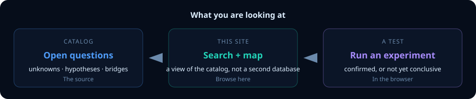
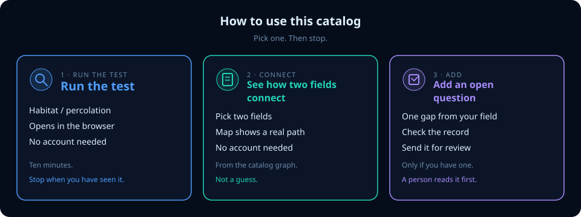

# How to use USDR

Do this first, before any other page:

**One example.** Habitat loss in ecology and percolation in physics are claimed to be the same math. USDR stores that claim, then lets you [run the test in the browser](https://kr8zysho3.github.io/Universal-Science-Discovery/repro/p-b-habitat-percolation-ecology-fss/index.html) (about a minute, no account). Finite landscapes have a shifted, blurred connectivity threshold; the shift scales as \(L^{-1/\nu}\) for this class of models. The browser run is a short look: if it says INCONCLUSIVE, the demo is small, not that the physics is wrong, and it does not recover \(\nu\). The full exponent check is the Python command in that folder. That is the whole product: an open connection, plus a test.

Then pick **one** of the two doors on the [site](https://kr8zysho3.github.io/Universal-Science-Discovery/dashboard/#start). You do not need the rest of the docs first.

| | Who | What to do | Stop when |
|--|-----|------------|-----------|
| **1. Try it** | Anyone, no account | Open the [site](https://kr8zysho3.github.io/Universal-Science-Discovery/dashboard/#start). Click **Try an experiment**. Search your field after. | You have seen a live test. |
| **2. Add a question** | You have one gap from your field | Write **one** open question, hypothesis, *or* bridge. Check it. Send it for review. | Detail: [first records guide](HAPPY_PATH_FIRST_RECORDS.md) |
| **3. Keep it honest** | You operate this site | Keep the numbers on the site matching the catalog files. | Detail: [operator checklist](DEV_DASHBOARD.md) |

## Try it

No account. Open the [site](https://kr8zysho3.github.io/Universal-Science-Discovery/dashboard/#start) and click **Try an experiment**. That jumps to a [browser test](https://kr8zysho3.github.io/Universal-Science-Discovery/dashboard/#crosscheck) (we call these Crosscheck). Then search your field if you want.

## Add a question

On the site, click **Add an open question**. Records are short structured notes. On GitHub, sending one for review is a “pull request” — a person reads it before it joins the catalog.

## Keep the catalog honest

Only if you run this site. Until a single operator list ships, use the [operator checklist](DEV_DASHBOARD.md).

## Words we avoid on the front door

| Instead of | We say |
|------------|--------|
| clone / fork / repo | get a copy of the catalog / this project |
| YAML | a record (the file format is a later detail) |
| PR / pull request | send it for review |
| CI is green | checks passed |
| git-native | the catalog files are the source |
| xref hygiene | fix a broken link |
| maintainer | someone who operates the site |

## Where the long docs sit

| Need | File |
|------|------|
| What we build next | [ROADMAP.md](../ROADMAP.md) |
| First records (step-by-step) | [HAPPY_PATH_FIRST_RECORDS.md](HAPPY_PATH_FIRST_RECORDS.md) |
| How the tests work | [CROSSCHECK.md](CROSSCHECK.md) |
| Claims vs speculation | [METHODOLOGY.md](METHODOLOGY.md), [VISION_AND_SCOPE.md](VISION_AND_SCOPE.md) |
| Operator checklist | [DEV_DASHBOARD.md](DEV_DASHBOARD.md) |
| Full contributor guide | [CONTRIBUTING.md](../CONTRIBUTING.md) |

This page is how a visitor should hear the project. GitHub words belong in the contributor guide, not on the first screen.
